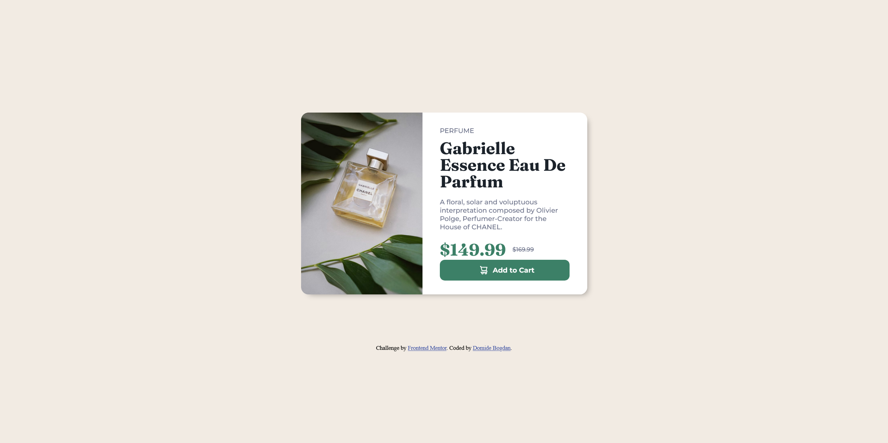

# Frontend Mentor - Product preview card component solution

This is a solution to the [Product preview card component challenge on Frontend Mentor](https://www.frontendmentor.io/challenges/product-preview-card-component-GO7UmttRfa). Frontend Mentor challenges help you improve your coding skills by building realistic projects. 

## Table of contents

- [Overview](#overview)
  - [The challenge](#the-challenge)
  - [Screenshot](#screenshot)
  - [Links](#links)
- [My process](#my-process)
  - [Built with](#built-with)
  - [What I learned](#what-i-learned)
  - [Useful resources](#useful-resources)
- [Author](#author)


## Overview

### The challenge

Users should be able to:

- View the optimal layout depending on their device's screen size
- See hover and focus states for interactive elements

### Screenshot



### Links

- Solution URL: [fontendmentor.io dbd-preview-card](https://www.frontendmentor.io/challenges/product-preview-card-component-GO7UmttRfa/hub/responsive-product-preview-card-component-ySUl4vyLRg)
- Live Site URL: [dbd-preview-card.netlify.app](https://dbd-product-card.netlify.app/)

## My process

### Built with

- Semantic HTML5 markup
- CSS custom properties
- Flexbox
- Mobile-first workflow
- Media queries

### What I learned

One of the main things that I learned on with this challenge was how to make use of the "content" property in css. Using this attribute you can serve the user with the relevant media depending on the device he is viewing from. This way you can have different designs for different screensizes.

```css
img {
  content: ulr(image.jpg);
}
```


### Useful resources

- [TheOdinProject](theodinproject.com/) - This served as a refresher for the basics of css and html
- [Kevin Powell](https://www.youtube.com/kepowob) - His tutorials helped me understand how to create a responsive website and how I should approach this task

## Author
- Frontend Mentor - [@domidebogdan](https://www.frontendmentor.io/profile/domidebogdan)
